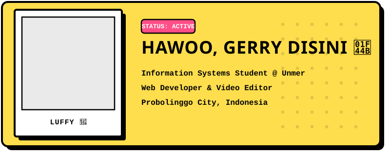
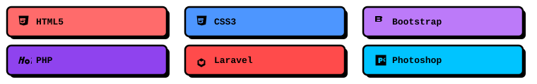

  

 

  
  
  

 

Hawoo! I'm **Gerry Robbie AG**, an Information Systems student based in Probolinggo City, Indonesia. 

* Currently studying **Information Systems** at Universitas Merdeka (Unmer).
* I build for the web and can write clean, effective code.
* Passionate about digital video editing and creating engaging content.

 

 

  

 

 

  
  &nbsp;&nbsp;
  

 

 

  <picture>
    <source media="(prefers-color-scheme: dark)" srcset="https://raw.githubusercontent.com/Gerryrag/Gerryrag/output/pacman-contribution-graph-dark.svg">
    <source media="(prefers-color-scheme: light)" srcset="https://raw.githubusercontent.com/Gerryrag/Gerryrag/output/pacman-contribution-graph.svg">
    
  </picture>

