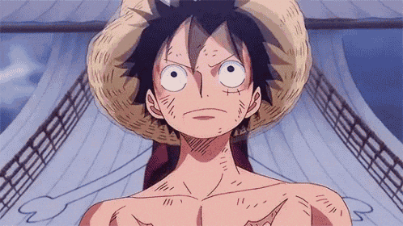

  
   
   

### Hawoo! Gerry Disini 👋

Selamat datang di Github personal saya

<!--
**Gerryrag/Gerryrag** is a ✨ _special_ ✨ repository because its `README.md` (this file) appears on your GitHub profile.

Here are some ideas to get you started:

- 🔭 I’m currently working on ...
- 🌱 I’m currently learning ...
- 👯 I’m looking to collaborate on ...
- 🤔 I’m looking for help with ...
- 💬 Ask me about ...
- 📫 How to reach me: ...
- 😄 Pronouns: ...
- ⚡ Fun fact: ...
-->

- **Nama Lengkap:** Gerry Robbie AG
- **Tanggal Lahir:** 26 Desember 2004
- **Hobi:** Makan
- **Alamat:** Probolinggo, Indonesia
- **Status:** Mahasiswa

### 🚀 Skills

  
  
  
  
  

### 📞 Contact

---

"Bukan jagoan coding, tapi tahu cara menyelesaikan masalah"

---
